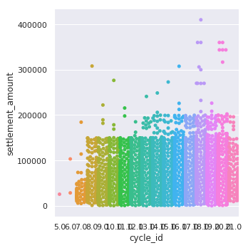

## Importing the necessary libraries


```python
import numpy as np 
import pandas as pd 
import matplotlib.pyplot as plt
%matplotlib inline
import seaborn as sns
import warnings
warnings.filterwarnings('ignore')
```

## Importing Data


```python
credit = pd.read_csv('final_datasets/credit_data.csv')
cycles = pd.read_csv('final_datasets/cycles.csv')
failure = pd.read_csv('final_datasets/failure_events_data.csv')
settlements = pd.read_csv('final_datasets/settlements_data.csv')
test = pd.read_csv('final_datasets/test.csv')
transactions = pd.read_csv('final_datasets/transactions_data.csv')
users = pd.read_csv('final_datasets/users_data.csv')
```

## Learning about data using .sample(), .info(), .describe(), .isnull().sum()

sample(n) -> Shows 'n' random rows present in dataset

info() -> Describes data types present, number of rows, number of columns, memory usage of dataset

describe() -> Generates descriptive statistics that summarize the central tendency, dispersion and shape of a dataset’s distribution, excluding NaN values.

isnull().sum() -> Shows number of NaN values present in each column in the DataFrame

#### Comment : This part is quite lengthy as it consists of understanding all the datasets, so you might want to skip this if you only want to see the visualizations / application of machine learning.


```python
credit.sample(7)
```


<div>
<style scoped>
    .dataframe tbody tr th:only-of-type {
        vertical-align: middle;
    }

    .dataframe tbody tr th {
        vertical-align: top;
    }

    .dataframe thead th {
        text-align: right;
    }
</style>
<table border="1" class="dataframe">
  <thead>
    <tr style="text-align: right;">
      <th></th>
      <th>user_id</th>
      <th>cycle_id</th>
      <th>global_credit_limit</th>
    </tr>
  </thead>
  <tbody>
    <tr>
      <th>17162</th>
      <td>8322</td>
      <td>14</td>
      <td>75000</td>
    </tr>
    <tr>
      <th>12403</th>
      <td>6588</td>
      <td>10</td>
      <td>150000</td>
    </tr>
    <tr>
      <th>2611</th>
      <td>9532</td>
      <td>14</td>
      <td>75000</td>
    </tr>
    <tr>
      <th>6812</th>
      <td>4111</td>
      <td>18</td>
      <td>150000</td>
    </tr>
    <tr>
      <th>18012</th>
      <td>4323</td>
      <td>9</td>
      <td>150000</td>
    </tr>
    <tr>
      <th>5137</th>
      <td>4764</td>
      <td>10</td>
      <td>150000</td>
    </tr>
    <tr>
      <th>11916</th>
      <td>11183</td>
      <td>19</td>
      <td>150000</td>
    </tr>
  </tbody>
</table>
</div>


```python
credit.info()
```

    <class 'pandas.core.frame.DataFrame'>
    RangeIndex: 18468 entries, 0 to 18467
    Data columns (total 3 columns):
    user_id                18468 non-null int64
    cycle_id               18468 non-null int64
    global_credit_limit    18468 non-null int64
    dtypes: int64(3)
    memory usage: 432.9 KB


```python
credit.describe()
```


<div>
<style scoped>
    .dataframe tbody tr th:only-of-type {
        vertical-align: middle;
    }

    .dataframe tbody tr th {
        vertical-align: top;
    }

    .dataframe thead th {
        text-align: right;
    }
</style>
<table border="1" class="dataframe">
  <thead>
    <tr style="text-align: right;">
      <th></th>
      <th>user_id</th>
      <th>cycle_id</th>
      <th>global_credit_limit</th>
    </tr>
  </thead>
  <tbody>
    <tr>
      <th>count</th>
      <td>18468.000000</td>
      <td>18468.000000</td>
      <td>18468.000000</td>
    </tr>
    <tr>
      <th>mean</th>
      <td>8067.809129</td>
      <td>14.217295</td>
      <td>126512.887156</td>
    </tr>
    <tr>
      <th>std</th>
      <td>4362.935645</td>
      <td>4.649221</td>
      <td>65312.491560</td>
    </tr>
    <tr>
      <th>min</th>
      <td>1.000000</td>
      <td>2.000000</td>
      <td>50000.000000</td>
    </tr>
    <tr>
      <th>25%</th>
      <td>4284.750000</td>
      <td>10.000000</td>
      <td>75000.000000</td>
    </tr>
    <tr>
      <th>50%</th>
      <td>8436.500000</td>
      <td>15.000000</td>
      <td>150000.000000</td>
    </tr>
    <tr>
      <th>75%</th>
      <td>11720.250000</td>
      <td>18.000000</td>
      <td>150000.000000</td>
    </tr>
    <tr>
      <th>max</th>
      <td>16045.000000</td>
      <td>22.000000</td>
      <td>1000000.000000</td>
    </tr>
  </tbody>
</table>
</div>


```python
credit.isnull().sum()
```


    user_id                0
    cycle_id               0
    global_credit_limit    0
    dtype: int64


```python
cycles.sample(7)
```


<div>
<style scoped>
    .dataframe tbody tr th:only-of-type {
        vertical-align: middle;
    }

    .dataframe tbody tr th {
        vertical-align: top;
    }

    .dataframe thead th {
        text-align: right;
    }
</style>
<table border="1" class="dataframe">
  <thead>
    <tr style="text-align: right;">
      <th></th>
      <th>cycle_id</th>
      <th>start_date</th>
      <th>end_date</th>
    </tr>
  </thead>
  <tbody>
    <tr>
      <th>12</th>
      <td>13</td>
      <td>2016-04-30 15:30:01 +0000 +0000</td>
      <td>2016-05-15 15:30:00 +0000 +0000</td>
    </tr>
    <tr>
      <th>10</th>
      <td>11</td>
      <td>2016-03-31 15:30:01 +0000 +0000</td>
      <td>2016-04-15 15:30:00 +0000 +0000</td>
    </tr>
    <tr>
      <th>3</th>
      <td>4</td>
      <td>2015-12-16 00:00:00 +0000 +0000</td>
      <td>2015-12-31 23:59:59 +0000 +0000</td>
    </tr>
    <tr>
      <th>15</th>
      <td>16</td>
      <td>2016-06-15 15:30:01 +0000 +0000</td>
      <td>2016-06-30 15:30:00 +0000 +0000</td>
    </tr>
    <tr>
      <th>21</th>
      <td>22</td>
      <td>2016-09-15 15:30:01 +0000 +0000</td>
      <td>2016-09-30 15:30:00 +0000 +0000</td>
    </tr>
    <tr>
      <th>5</th>
      <td>6</td>
      <td>2016-01-16 00:00:00 +0000 +0000</td>
      <td>2016-01-31 23:59:59 +0000 +0000</td>
    </tr>
    <tr>
      <th>0</th>
      <td>1</td>
      <td>2015-11-01 00:00:00 +0000 +0000</td>
      <td>2015-11-15 00:00:00 +0000 +0000</td>
    </tr>
  </tbody>
</table>
</div>


```python
cycles.info()
```

    <class 'pandas.core.frame.DataFrame'>
    RangeIndex: 23 entries, 0 to 22
    Data columns (total 3 columns):
    cycle_id      23 non-null int64
    start_date    23 non-null object
    end_date      23 non-null object
    dtypes: int64(1), object(2)
    memory usage: 632.0+ bytes


```python
cycles.isnull().sum()
```


    cycle_id      0
    start_date    0
    end_date      0
    dtype: int64


```python
failure.sample(7)
```


<div>
<style scoped>
    .dataframe tbody tr th:only-of-type {
        vertical-align: middle;
    }

    .dataframe tbody tr th {
        vertical-align: top;
    }

    .dataframe thead th {
        text-align: right;
    }
</style>
<table border="1" class="dataframe">
  <thead>
    <tr style="text-align: right;">
      <th></th>
      <th>failure_event_id</th>
      <th>transaction_id</th>
      <th>user_id</th>
      <th>failure_type</th>
      <th>amount_in_paise</th>
      <th>created_at</th>
    </tr>
  </thead>
  <tbody>
    <tr>
      <th>12366</th>
      <td>12367</td>
      <td>104031</td>
      <td>11970</td>
      <td>error2</td>
      <td>28200</td>
      <td>2016-08-21 11:10:26.402877 +0000 +0000</td>
    </tr>
    <tr>
      <th>1536</th>
      <td>1537</td>
      <td>18902</td>
      <td>5027</td>
      <td>error1</td>
      <td>21400</td>
      <td>2016-04-12 15:17:19.987564 +0000 +0000</td>
    </tr>
    <tr>
      <th>2617</th>
      <td>2618</td>
      <td>29581</td>
      <td>5776</td>
      <td>error2</td>
      <td>22400</td>
      <td>2016-05-01 17:30:40.052621 +0000 +0000</td>
    </tr>
    <tr>
      <th>5023</th>
      <td>5024</td>
      <td>50277</td>
      <td>4511</td>
      <td>error2</td>
      <td>37000</td>
      <td>2016-06-06 16:34:02.908327 +0000 +0000</td>
    </tr>
    <tr>
      <th>6484</th>
      <td>6485</td>
      <td>61210</td>
      <td>5636</td>
      <td>error2</td>
      <td>47600</td>
      <td>2016-06-24 17:09:21.680878 +0000 +0000</td>
    </tr>
    <tr>
      <th>6766</th>
      <td>6767</td>
      <td>63007</td>
      <td>834</td>
      <td>error3</td>
      <td>28700</td>
      <td>2016-06-27 13:01:40.765798 +0000 +0000</td>
    </tr>
    <tr>
      <th>1414</th>
      <td>1415</td>
      <td>17079</td>
      <td>5837</td>
      <td>error3</td>
      <td>28500</td>
      <td>2016-04-07 15:44:11.761376 +0000 +0000</td>
    </tr>
  </tbody>
</table>
</div>


```python
failure.info()
```

    <class 'pandas.core.frame.DataFrame'>
    RangeIndex: 17993 entries, 0 to 17992
    Data columns (total 6 columns):
    failure_event_id    17993 non-null int64
    transaction_id      17993 non-null int64
    user_id             17993 non-null int64
    failure_type        17993 non-null object
    amount_in_paise     17993 non-null int64
    created_at          17993 non-null object
    dtypes: int64(4), object(2)
    memory usage: 843.5+ KB


```python
failure.describe()
```


<div>
<style scoped>
    .dataframe tbody tr th:only-of-type {
        vertical-align: middle;
    }

    .dataframe tbody tr th {
        vertical-align: top;
    }

    .dataframe thead th {
        text-align: right;
    }
</style>
<table border="1" class="dataframe">
  <thead>
    <tr style="text-align: right;">
      <th></th>
      <th>failure_event_id</th>
      <th>transaction_id</th>
      <th>user_id</th>
      <th>amount_in_paise</th>
    </tr>
  </thead>
  <tbody>
    <tr>
      <th>count</th>
      <td>17993.000000</td>
      <td>17993.000000</td>
      <td>17993.000000</td>
      <td>1.799300e+04</td>
    </tr>
    <tr>
      <th>mean</th>
      <td>8997.000000</td>
      <td>77461.629800</td>
      <td>7005.346079</td>
      <td>4.127597e+04</td>
    </tr>
    <tr>
      <th>std</th>
      <td>5194.276032</td>
      <td>39255.071653</td>
      <td>4102.698217</td>
      <td>1.039872e+05</td>
    </tr>
    <tr>
      <th>min</th>
      <td>1.000000</td>
      <td>56.000000</td>
      <td>1.000000</td>
      <td>0.000000e+00</td>
    </tr>
    <tr>
      <th>25%</th>
      <td>4499.000000</td>
      <td>45380.000000</td>
      <td>3437.000000</td>
      <td>1.900000e+04</td>
    </tr>
    <tr>
      <th>50%</th>
      <td>8997.000000</td>
      <td>79189.000000</td>
      <td>6817.000000</td>
      <td>2.680000e+04</td>
    </tr>
    <tr>
      <th>75%</th>
      <td>13495.000000</td>
      <td>111762.000000</td>
      <td>10327.000000</td>
      <td>3.890000e+04</td>
    </tr>
    <tr>
      <th>max</th>
      <td>17993.000000</td>
      <td>141704.000000</td>
      <td>16029.000000</td>
      <td>1.045490e+07</td>
    </tr>
  </tbody>
</table>
</div>


```python
failure.isnull().sum()
```


    failure_event_id    0
    transaction_id      0
    user_id             0
    failure_type        0
    amount_in_paise     0
    created_at          0
    dtype: int64


```python
settlements.sample(7)
```


<div>
<style scoped>
    .dataframe tbody tr th:only-of-type {
        vertical-align: middle;
    }

    .dataframe tbody tr th {
        vertical-align: top;
    }

    .dataframe thead th {
        text-align: right;
    }
</style>
<table border="1" class="dataframe">
  <thead>
    <tr style="text-align: right;">
      <th></th>
      <th>id</th>
      <th>user_id</th>
      <th>cycle_id</th>
      <th>settlement_amount</th>
      <th>settlement_status</th>
      <th>days_delayed</th>
      <th>bill_created_at</th>
      <th>settled_at</th>
    </tr>
  </thead>
  <tbody>
    <tr>
      <th>23270</th>
      <td>7742</td>
      <td>1679</td>
      <td>13.0</td>
      <td>123000</td>
      <td>onetime_settlement</td>
      <td>NaN</td>
      <td>NaN</td>
      <td>2016-05-08 09:25:40.873556 +0000 +0000</td>
    </tr>
    <tr>
      <th>21249</th>
      <td>9134</td>
      <td>5481</td>
      <td>13.0</td>
      <td>31700</td>
      <td>bill_settled</td>
      <td>8.019809</td>
      <td>2016-05-15 15:37:48.676583 +0000 +0000</td>
      <td>2016-05-23 16:06:20.160917 +0000 +0000</td>
    </tr>
    <tr>
      <th>19246</th>
      <td>8259</td>
      <td>13096</td>
      <td>13.0</td>
      <td>26200</td>
      <td>bill_settled</td>
      <td>17.852984</td>
      <td>2016-05-15 15:31:19.32232 +0000 +0000</td>
      <td>2016-06-02 11:59:37.136416 +0000 +0000</td>
    </tr>
    <tr>
      <th>18733</th>
      <td>8881</td>
      <td>4211</td>
      <td>13.0</td>
      <td>32100</td>
      <td>bill_settled</td>
      <td>21.746186</td>
      <td>2016-05-15 15:34:42.74746 +0000 +0000</td>
      <td>2016-06-06 09:29:13.179089 +0000 +0000</td>
    </tr>
    <tr>
      <th>27452</th>
      <td>3115</td>
      <td>3204</td>
      <td>10.0</td>
      <td>52300</td>
      <td>bill_settled</td>
      <td>1.001040</td>
      <td>2016-03-31 15:32:43.079853 +0000 +0000</td>
      <td>2016-04-01 15:34:12.893315 +0000 +0000</td>
    </tr>
    <tr>
      <th>20647</th>
      <td>8100</td>
      <td>196</td>
      <td>13.0</td>
      <td>148300</td>
      <td>bill_settled</td>
      <td>16.005357</td>
      <td>2016-05-15 15:30:25.324164 +0000 +0000</td>
      <td>2016-05-31 15:38:08.193015 +0000 +0000</td>
    </tr>
    <tr>
      <th>25369</th>
      <td>5589</td>
      <td>6208</td>
      <td>12.0</td>
      <td>23900</td>
      <td>onetime_settlement</td>
      <td>NaN</td>
      <td>NaN</td>
      <td>2016-04-25 07:19:12.701964 +0000 +0000</td>
    </tr>
  </tbody>
</table>
</div>


```python
settlements.info()
```

    <class 'pandas.core.frame.DataFrame'>
    RangeIndex: 30683 entries, 0 to 30682
    Data columns (total 8 columns):
    id                   30683 non-null int64
    user_id              30683 non-null int64
    cycle_id             30681 non-null float64
    settlement_amount    30683 non-null int64
    settlement_status    30683 non-null object
    days_delayed         22395 non-null float64
    bill_created_at      24980 non-null object
    settled_at           28098 non-null object
    dtypes: float64(2), int64(3), object(3)
    memory usage: 1.9+ MB


```python
settlements.describe()
```


<div>
<style scoped>
    .dataframe tbody tr th:only-of-type {
        vertical-align: middle;
    }

    .dataframe tbody tr th {
        vertical-align: top;
    }

    .dataframe thead th {
        text-align: right;
    }
</style>
<table border="1" class="dataframe">
  <thead>
    <tr style="text-align: right;">
      <th></th>
      <th>id</th>
      <th>user_id</th>
      <th>cycle_id</th>
      <th>settlement_amount</th>
      <th>days_delayed</th>
    </tr>
  </thead>
  <tbody>
    <tr>
      <th>count</th>
      <td>30683.000000</td>
      <td>30683.000000</td>
      <td>30681.000000</td>
      <td>30683.000000</td>
      <td>22395.000000</td>
    </tr>
    <tr>
      <th>mean</th>
      <td>15378.590620</td>
      <td>6210.827527</td>
      <td>15.237737</td>
      <td>50890.082065</td>
      <td>5.098359</td>
    </tr>
    <tr>
      <th>std</th>
      <td>8907.130545</td>
      <td>3667.269698</td>
      <td>3.560640</td>
      <td>40286.805289</td>
      <td>9.669068</td>
    </tr>
    <tr>
      <th>min</th>
      <td>1.000000</td>
      <td>1.000000</td>
      <td>5.000000</td>
      <td>37.000000</td>
      <td>0.000674</td>
    </tr>
    <tr>
      <th>25%</th>
      <td>7676.500000</td>
      <td>3282.000000</td>
      <td>13.000000</td>
      <td>23300.000000</td>
      <td>0.587529</td>
    </tr>
    <tr>
      <th>50%</th>
      <td>15351.000000</td>
      <td>5927.000000</td>
      <td>16.000000</td>
      <td>37600.000000</td>
      <td>1.185550</td>
    </tr>
    <tr>
      <th>75%</th>
      <td>23030.500000</td>
      <td>8962.000000</td>
      <td>18.000000</td>
      <td>65464.000000</td>
      <td>5.789314</td>
    </tr>
    <tr>
      <th>max</th>
      <td>31096.000000</td>
      <td>16033.000000</td>
      <td>21.000000</td>
      <td>746000.000000</td>
      <td>210.576996</td>
    </tr>
  </tbody>
</table>
</div>


```python
settlements.isnull().sum()
```


    id                      0
    user_id                 0
    cycle_id                2
    settlement_amount       0
    settlement_status       0
    days_delayed         8288
    bill_created_at      5703
    settled_at           2585
    dtype: int64


```python
settlements.settlement_status.value_counts()
```


    bill_settled          22395
    onetime_settlement     5703
    bill_pending           2585
    Name: settlement_status, dtype: int64


```python
test.head(7)
```


<div>
<style scoped>
    .dataframe tbody tr th:only-of-type {
        vertical-align: middle;
    }

    .dataframe tbody tr th {
        vertical-align: top;
    }

    .dataframe thead th {
        text-align: right;
    }
</style>
<table border="1" class="dataframe">
  <thead>
    <tr style="text-align: right;">
      <th></th>
      <th>user_id</th>
    </tr>
  </thead>
  <tbody>
    <tr>
      <th>0</th>
      <td>1435</td>
    </tr>
    <tr>
      <th>1</th>
      <td>9826</td>
    </tr>
    <tr>
      <th>2</th>
      <td>5700</td>
    </tr>
    <tr>
      <th>3</th>
      <td>9548</td>
    </tr>
    <tr>
      <th>4</th>
      <td>7358</td>
    </tr>
    <tr>
      <th>5</th>
      <td>11706</td>
    </tr>
    <tr>
      <th>6</th>
      <td>12399</td>
    </tr>
  </tbody>
</table>
</div>


```python
test.shape
```


    (3493, 1)


```python
transactions.sample(7)
```


<div>
<style scoped>
    .dataframe tbody tr th:only-of-type {
        vertical-align: middle;
    }

    .dataframe tbody tr th {
        vertical-align: top;
    }

    .dataframe thead th {
        text-align: right;
    }
</style>
<table border="1" class="dataframe">
  <thead>
    <tr style="text-align: right;">
      <th></th>
      <th>transaction_id</th>
      <th>user_id</th>
      <th>merchant_id</th>
      <th>transaction_amount</th>
      <th>created_at</th>
    </tr>
  </thead>
  <tbody>
    <tr>
      <th>39882</th>
      <td>67941</td>
      <td>10358</td>
      <td>1</td>
      <td>20100</td>
      <td>2016-07-03 08:22:35.823276 +0000 +0000</td>
    </tr>
    <tr>
      <th>66315</th>
      <td>16552</td>
      <td>1956</td>
      <td>1</td>
      <td>28300</td>
      <td>2016-04-06 08:45:04.421555 +0000 +0000</td>
    </tr>
    <tr>
      <th>11294</th>
      <td>121166</td>
      <td>11020</td>
      <td>1</td>
      <td>28000</td>
      <td>2016-09-09 16:36:47.570483 +0000 +0000</td>
    </tr>
    <tr>
      <th>9798</th>
      <td>123725</td>
      <td>12080</td>
      <td>1</td>
      <td>31100</td>
      <td>2016-09-13 07:03:04.757082 +0000 +0000</td>
    </tr>
    <tr>
      <th>12571</th>
      <td>119158</td>
      <td>7752</td>
      <td>1</td>
      <td>27500</td>
      <td>2016-09-06 18:06:46.52098 +0000 +0000</td>
    </tr>
    <tr>
      <th>54068</th>
      <td>40624</td>
      <td>11560</td>
      <td>1</td>
      <td>21500</td>
      <td>2016-05-22 06:30:07.123618 +0000 +0000</td>
    </tr>
    <tr>
      <th>10289</th>
      <td>122799</td>
      <td>5700</td>
      <td>1</td>
      <td>38500</td>
      <td>2016-09-11 16:54:27.47874 +0000 +0000</td>
    </tr>
  </tbody>
</table>
</div>


```python
transactions.info()
```

    <class 'pandas.core.frame.DataFrame'>
    RangeIndex: 73731 entries, 0 to 73730
    Data columns (total 5 columns):
    transaction_id        73731 non-null int64
    user_id               73731 non-null int64
    merchant_id           73731 non-null int64
    transaction_amount    73731 non-null int64
    created_at            73731 non-null object
    dtypes: int64(4), object(1)
    memory usage: 2.8+ MB


```python
transactions.describe()
```


<div>
<style scoped>
    .dataframe tbody tr th:only-of-type {
        vertical-align: middle;
    }

    .dataframe tbody tr th {
        vertical-align: top;
    }

    .dataframe thead th {
        text-align: right;
    }
</style>
<table border="1" class="dataframe">
  <thead>
    <tr style="text-align: right;">
      <th></th>
      <th>transaction_id</th>
      <th>user_id</th>
      <th>merchant_id</th>
      <th>transaction_amount</th>
    </tr>
  </thead>
  <tbody>
    <tr>
      <th>count</th>
      <td>73731.000000</td>
      <td>73731.000000</td>
      <td>73731.000000</td>
      <td>73731.000000</td>
    </tr>
    <tr>
      <th>mean</th>
      <td>72930.399113</td>
      <td>6747.953615</td>
      <td>1.711749</td>
      <td>27335.566844</td>
    </tr>
    <tr>
      <th>std</th>
      <td>40622.112620</td>
      <td>4019.003265</td>
      <td>2.335634</td>
      <td>19021.921623</td>
    </tr>
    <tr>
      <th>min</th>
      <td>26.000000</td>
      <td>1.000000</td>
      <td>1.000000</td>
      <td>0.000000</td>
    </tr>
    <tr>
      <th>25%</th>
      <td>38666.500000</td>
      <td>3402.000000</td>
      <td>1.000000</td>
      <td>17200.000000</td>
    </tr>
    <tr>
      <th>50%</th>
      <td>73366.000000</td>
      <td>6415.000000</td>
      <td>1.000000</td>
      <td>23700.000000</td>
    </tr>
    <tr>
      <th>75%</th>
      <td>107865.000000</td>
      <td>9907.000000</td>
      <td>1.000000</td>
      <td>31900.000000</td>
    </tr>
    <tr>
      <th>max</th>
      <td>141695.000000</td>
      <td>16045.000000</td>
      <td>18.000000</td>
      <td>746000.000000</td>
    </tr>
  </tbody>
</table>
</div>


```python
users.sample(7)
```


<div>
<style scoped>
    .dataframe tbody tr th:only-of-type {
        vertical-align: middle;
    }

    .dataframe tbody tr th {
        vertical-align: top;
    }

    .dataframe thead th {
        text-align: right;
    }
</style>
<table border="1" class="dataframe">
  <thead>
    <tr style="text-align: right;">
      <th></th>
      <th>user_id</th>
      <th>referrer</th>
      <th>email</th>
      <th>name</th>
      <th>city_id</th>
    </tr>
  </thead>
  <tbody>
    <tr>
      <th>14225</th>
      <td>14226</td>
      <td>a</td>
      <td>14226@9.com</td>
      <td>ud s</td>
      <td>4.0</td>
    </tr>
    <tr>
      <th>14632</th>
      <td>14633</td>
      <td>f</td>
      <td>NaN</td>
      <td>NaN</td>
      <td>NaN</td>
    </tr>
    <tr>
      <th>7945</th>
      <td>7946</td>
      <td>a</td>
      <td>7946@1.com</td>
      <td>ukee</td>
      <td>6.0</td>
    </tr>
    <tr>
      <th>5286</th>
      <td>5287</td>
      <td>a</td>
      <td>5287@1.com</td>
      <td>huam</td>
      <td>1.0</td>
    </tr>
    <tr>
      <th>1116</th>
      <td>1117</td>
      <td>a</td>
      <td>1117@1.com</td>
      <td>hoik</td>
      <td>3.0</td>
    </tr>
    <tr>
      <th>3592</th>
      <td>3593</td>
      <td>a</td>
      <td>3593@9.com</td>
      <td>rad</td>
      <td>1.0</td>
    </tr>
    <tr>
      <th>7365</th>
      <td>7366</td>
      <td>a</td>
      <td>7366@1.com</td>
      <td>amh</td>
      <td>1.0</td>
    </tr>
  </tbody>
</table>
</div>


```python
users.info()
```

    <class 'pandas.core.frame.DataFrame'>
    RangeIndex: 16050 entries, 0 to 16049
    Data columns (total 5 columns):
    user_id     16050 non-null int64
    referrer    16028 non-null object
    email       14970 non-null object
    name        15065 non-null object
    city_id     12945 non-null float64
    dtypes: float64(1), int64(1), object(3)
    memory usage: 627.0+ KB


```python
users.city_id.value_counts().head(10)
```


    1.0     3779
    3.0     2156
    2.0     1497
    4.0     1089
    7.0     1068
    5.0     1039
    6.0      905
    9.0      452
    22.0     206
    20.0     111
    Name: city_id, dtype: int64


```python
users.referrer.value_counts().head()
```


    a    13066
    o      766
    e      523
    j      489
    k      487
    Name: referrer, dtype: int64


```python
users.isnull().sum()
```


    user_id        0
    referrer      22
    email       1080
    name         985
    city_id     3105
    dtype: int64


### Finding Cycles belonging to each Transaction Id


```python
c = cycles[['start_date', 'end_date']].values
transactions['cycle_id'] = 0
transactions.cycle_id.value_counts()
```


```python
abc = []
for index, row in transactions.iterrows():
    for a,b in enumerate(c):
        if ((row['created_at'] >= c[a][0]) and (row['created_at'] < c[a][1])):
            row['cycle_id'] = a+1
    abc.append(row['cycle_id'])
    

l = pd.DataFrame(abc, columns = ['cycle_id'])
l.cycle_id.value_counts().head()
```


    22    8666
    20    7307
    21    7159
    18    6515
    19    6057
    Name: cycle_id, dtype: int64


```python
transactions[['cycle_id']] = l[['cycle_id']]
transactions.cycle_id.unique()
```


    array([22, 21, 20, 19, 18, 17, 16, 15, 14, 13, 12, 11, 10,  9,  8,  7,  6,
            5,  4,  0,  3])


## Visual Analysis & Interpretation of the Dataset


```python
sns.set(rc={'figure.figsize':(14.7,10.27)}, style="darkgrid")
```

### Settlements


```python
settlements['settlement_status'].value_counts()
```


    bill_settled          22395
    onetime_settlement     5703
    bill_pending           2585
    Name: settlement_status, dtype: int64


#### Settlement_amount has a mean of roughly 50,000. A distribution of the same has been shown below


```python
settlements.settlement_amount.describe()
```


    count     30683.000000
    mean      50890.082065
    std       40286.805289
    min          37.000000
    25%       23300.000000
    50%       37600.000000
    75%       65464.000000
    max      746000.000000
    Name: settlement_amount, dtype: float64


```python
sns.countplot(x='settlement_amount',palette="Set3",data=settlements) # frequency distribution of settlement_amount
```


    <matplotlib.axes._subplots.AxesSubplot at 0x7fa4f200eb38>


#### Settlement Amount 

Settlement Amount is seen to be relatively higher in the more recent cycles (barring a few outliers). 

Could indicate that people have started using APS more regularly since it's inception. Will discuss further in transactions


```python
sns.catplot(y="settlement_amount", x="cycle_id", kind="swarm", data=settlements.sample(10000))
```


    <seaborn.axisgrid.FacetGrid at 0x7fa4efb63cc0>





```python
# removing top two values for a better visual representation
settlements = settlements[settlements.settlement_amount != 746000]
settlements = settlements[settlements.settlement_amount != 710500]
```

#### Settlement status vs Settlement amount

While they do not differ a lot in terms of their distribution, we can still learn something.

1. Even though most settlements are centered around the 50,000 mark, quite a few outliers are present on the upside of 1,00,0000.

2. Bills which are settled have a lot more outliers involved than the other two.


```python
settlements.settlement_status.value_counts()
```


    bill_settled          22394
    onetime_settlement     5703
    bill_pending           2584
    Name: settlement_status, dtype: int64


```python
sns.catplot(y='settlement_amount', col='settlement_status', kind='box', data=settlements)
```


    <seaborn.axisgrid.FacetGrid at 0x7fa4ed45c8d0>


#### Days Delayed

One should expect that settlements with large value take more time to receive, but we can observe from this scatter plot that most settlements with lesser amounts are the ones who take a longer time.

It has a mean of 5 days +/- 9.6 days of standard deviation.


```python
settlements.days_delayed.describe()
```


    count    22394.000000
    mean         5.098553
    std          9.669240
    min          0.000674
    25%          0.587513
    50%          1.186390
    75%          5.790339
    max        210.576996
    Name: days_delayed, dtype: float64


```python
sns.scatterplot(y="days_delayed", x="settlement_amount", data=settlements)
```


    <matplotlib.axes._subplots.AxesSubplot at 0x7fa4ebfdbac8>


## Transactions Analysis


```python
transactions.head()
```


<div>
<style scoped>
    .dataframe tbody tr th:only-of-type {
        vertical-align: middle;
    }

    .dataframe tbody tr th {
        vertical-align: top;
    }

    .dataframe thead th {
        text-align: right;
    }
</style>
<table border="1" class="dataframe">
  <thead>
    <tr style="text-align: right;">
      <th></th>
      <th>transaction_id</th>
      <th>user_id</th>
      <th>merchant_id</th>
      <th>transaction_amount</th>
      <th>created_at</th>
      <th>cycle_id</th>
    </tr>
  </thead>
  <tbody>
    <tr>
      <th>0</th>
      <td>141695</td>
      <td>13693</td>
      <td>1</td>
      <td>10100</td>
      <td>2016-09-30 15:29:10.228672 +0000 +0000</td>
      <td>22</td>
    </tr>
    <tr>
      <th>1</th>
      <td>141694</td>
      <td>8166</td>
      <td>1</td>
      <td>20900</td>
      <td>2016-09-30 15:29:00.286923 +0000 +0000</td>
      <td>22</td>
    </tr>
    <tr>
      <th>2</th>
      <td>141688</td>
      <td>15886</td>
      <td>1</td>
      <td>28100</td>
      <td>2016-09-30 15:27:55.801021 +0000 +0000</td>
      <td>22</td>
    </tr>
    <tr>
      <th>3</th>
      <td>141686</td>
      <td>12014</td>
      <td>8</td>
      <td>18000</td>
      <td>2016-09-30 15:27:17.891471 +0000 +0000</td>
      <td>22</td>
    </tr>
    <tr>
      <th>4</th>
      <td>141684</td>
      <td>12392</td>
      <td>1</td>
      <td>63500</td>
      <td>2016-09-30 15:25:56.857979 +0000 +0000</td>
      <td>22</td>
    </tr>
  </tbody>
</table>
</div>


### Transactions per Merchant

1. Most transactions done from Merchant 1 which ranges from 0 - 1,00,000
2. Merchant 8 and 6 have a great range of products and have sold products from cheap and expensive ranges.
3. Most significant competititors to Merchant 1 are Merchant (7,8,11,9).
4. Merchant (2,11-18) have very little selling power and range.


```python
transactions.merchant_id.value_counts().head(5)
```


    1     66845
    7      2273
    8      1114
    11      900
    9       854
    Name: merchant_id, dtype: int64


```python
g = sns.catplot(x="merchant_id", y="transaction_amount", kind="violin", inner=None, data=transactions.sample(1000))
sns.swarmplot(x="merchant_id", y="transaction_amount", color="k", size=3, data=transactions.sample(1000), ax=g.ax);
```


```python
transactions.transaction_amount.nsmallest()
```


    33147     0
    73728     0
    826      44
    44088    66
    2534     76
    Name: transaction_amount, dtype: int64


### Transactions per Cycle

1. Most transactions have been done in later cycles and also observed in settlements made in later cycles. Explains that APS has grown in popularity of late or just that the existing customers have had larger amounts to spend.

2. Cycle 22 dominates the charts with heavy presence of merchant 1 as previously noted.

3. A consistent trend of transactions has been observed in the last few cycles.


```python
l1 = transactions.groupby(['cycle_id'])[['transaction_amount']].sum()
l1.head()
```


<div>
<style scoped>
    .dataframe tbody tr th:only-of-type {
        vertical-align: middle;
    }

    .dataframe tbody tr th {
        vertical-align: top;
    }

    .dataframe thead th {
        text-align: right;
    }
</style>
<table border="1" class="dataframe">
  <thead>
    <tr style="text-align: right;">
      <th></th>
      <th>transaction_amount</th>
    </tr>
    <tr>
      <th>cycle_id</th>
      <th></th>
    </tr>
  </thead>
  <tbody>
    <tr>
      <th>0</th>
      <td>9400</td>
    </tr>
    <tr>
      <th>3</th>
      <td>4000</td>
    </tr>
    <tr>
      <th>4</th>
      <td>7000</td>
    </tr>
    <tr>
      <th>5</th>
      <td>81900</td>
    </tr>
    <tr>
      <th>6</th>
      <td>391600</td>
    </tr>
  </tbody>
</table>
</div>


```python
sns.scatterplot(x=transactions.cycle_id, y=transactions.transaction_amount, hue=transactions.merchant_id, palette='Set1')
```


    <matplotlib.axes._subplots.AxesSubplot at 0x7fa4ec382780>


```python
l1 = transactions.groupby(['user_id'])[['transaction_amount']].sum()
l1.head()
```


<div>
<style scoped>
    .dataframe tbody tr th:only-of-type {
        vertical-align: middle;
    }

    .dataframe tbody tr th {
        vertical-align: top;
    }

    .dataframe thead th {
        text-align: right;
    }
</style>
<table border="1" class="dataframe">
  <thead>
    <tr style="text-align: right;">
      <th></th>
      <th>transaction_amount</th>
    </tr>
    <tr>
      <th>user_id</th>
      <th></th>
    </tr>
  </thead>
  <tbody>
    <tr>
      <th>1</th>
      <td>208300</td>
    </tr>
    <tr>
      <th>2</th>
      <td>975079</td>
    </tr>
    <tr>
      <th>4</th>
      <td>173800</td>
    </tr>
    <tr>
      <th>5</th>
      <td>112600</td>
    </tr>
    <tr>
      <th>6</th>
      <td>1123286</td>
    </tr>
  </tbody>
</table>
</div>


```python
l3.head()
```


<div>
<style scoped>
    .dataframe tbody tr th:only-of-type {
        vertical-align: middle;
    }

    .dataframe tbody tr th {
        vertical-align: top;
    }

    .dataframe thead th {
        text-align: right;
    }
</style>
<table border="1" class="dataframe">
  <thead>
    <tr style="text-align: right;">
      <th></th>
      <th></th>
      <th>transaction_amount</th>
      <th>settlement_amount</th>
    </tr>
    <tr>
      <th>user_id</th>
      <th>cycle_id</th>
      <th></th>
      <th></th>
    </tr>
  </thead>
  <tbody>
    <tr>
      <th rowspan="3" valign="top">1</th>
      <th>14.0</th>
      <td>67200.0</td>
      <td>67200.0</td>
    </tr>
    <tr>
      <th>15.0</th>
      <td>32500.0</td>
      <td>32500.0</td>
    </tr>
    <tr>
      <th>18.0</th>
      <td>108600.0</td>
      <td>108600.0</td>
    </tr>
    <tr>
      <th rowspan="2" valign="top">2</th>
      <th>5.0</th>
      <td>13000.0</td>
      <td>13000.0</td>
    </tr>
    <tr>
      <th>6.0</th>
      <td>21000.0</td>
      <td>0.0</td>
    </tr>
  </tbody>
</table>
</div>


## Failures Analysis

#### Types of failures observed with varying transaction amounts

1. Failure error 3 & 2 are observed when transacting big amounts.

2. Failure error 1, 2, 3 are observed more frequently than 4, 5, 6.


```python
sns.catplot(x="failure_type", y="amount_in_paise", palette="ch:.25", data=failure);
```


```python
# Removing the outlier
failure = failure[failure.amount_in_paise != 10454900]
```


```python
sns.catplot(x="failure_type", y="amount_in_paise", palette="ch:.25", data=failure)
```


    <seaborn.axisgrid.FacetGrid at 0x7fa4f294e8d0>


### Transactions from different cities

1. Observation from the scatterplot is that high number of transactions are being made from cities 1-10, especially 1, 3, 5.

2. A somewhat decreasing trend continues from cities 10-50 and then cities 50 and so on, a consistent pattern of transactions below 50,000 with a few outliers.


```python
l1 = transactions.groupby(['user_id'])[['transaction_amount', 'cycle_id']].sum()
ci = users.groupby(['user_id'])[['city_id']].sum()
city = pd.concat([l1, ci],axis=1)
city = city.dropna()
city.head()
```


<div>
<style scoped>
    .dataframe tbody tr th:only-of-type {
        vertical-align: middle;
    }

    .dataframe tbody tr th {
        vertical-align: top;
    }

    .dataframe thead th {
        text-align: right;
    }
</style>
<table border="1" class="dataframe">
  <thead>
    <tr style="text-align: right;">
      <th></th>
      <th>transaction_amount</th>
      <th>cycle_id</th>
      <th>city_id</th>
    </tr>
    <tr>
      <th>user_id</th>
      <th></th>
      <th></th>
      <th></th>
    </tr>
  </thead>
  <tbody>
    <tr>
      <th>1</th>
      <td>208300.0</td>
      <td>93.0</td>
      <td>4.0</td>
    </tr>
    <tr>
      <th>2</th>
      <td>975079.0</td>
      <td>570.0</td>
      <td>7.0</td>
    </tr>
    <tr>
      <th>4</th>
      <td>173800.0</td>
      <td>198.0</td>
      <td>3.0</td>
    </tr>
    <tr>
      <th>5</th>
      <td>112600.0</td>
      <td>64.0</td>
      <td>7.0</td>
    </tr>
    <tr>
      <th>6</th>
      <td>1123286.0</td>
      <td>485.0</td>
      <td>154.0</td>
    </tr>
  </tbody>
</table>
</div>


```python
city[['city_id', 'transaction_amount']].nlargest(5,columns = ['transaction_amount'])
```


<div>
<style scoped>
    .dataframe tbody tr th:only-of-type {
        vertical-align: middle;
    }

    .dataframe tbody tr th {
        vertical-align: top;
    }

    .dataframe thead th {
        text-align: right;
    }
</style>
<table border="1" class="dataframe">
  <thead>
    <tr style="text-align: right;">
      <th></th>
      <th>city_id</th>
      <th>transaction_amount</th>
    </tr>
    <tr>
      <th>user_id</th>
      <th></th>
      <th></th>
    </tr>
  </thead>
  <tbody>
    <tr>
      <th>3346</th>
      <td>1.0</td>
      <td>2874600.0</td>
    </tr>
    <tr>
      <th>12</th>
      <td>3.0</td>
      <td>2733600.0</td>
    </tr>
    <tr>
      <th>975</th>
      <td>3.0</td>
      <td>2617300.0</td>
    </tr>
    <tr>
      <th>3392</th>
      <td>1.0</td>
      <td>2572300.0</td>
    </tr>
    <tr>
      <th>17</th>
      <td>3.0</td>
      <td>2546700.0</td>
    </tr>
  </tbody>
</table>
</div>


```python
sns.scatterplot(x="city_id", y="transaction_amount", palette="Set2", data=city)
```


    <matplotlib.axes._subplots.AxesSubplot at 0x7fa4ec01f2b0>


### Referrers vs Transactions

1. Referrer a, e have suggested to make bigger transactions.

2. Referrer b, m , n, o have made really low amounts of transactions and very few of those.


```python
l1 = transactions.groupby(['user_id'])[['transaction_amount']].sum()
ref = users.groupby(['user_id'])[['referrer']].sum()
referral = pd.concat([l1, ref],axis=1)
referral = referral.dropna()
referral.head()
```


<div>
<style scoped>
    .dataframe tbody tr th:only-of-type {
        vertical-align: middle;
    }

    .dataframe tbody tr th {
        vertical-align: top;
    }

    .dataframe thead th {
        text-align: right;
    }
</style>
<table border="1" class="dataframe">
  <thead>
    <tr style="text-align: right;">
      <th></th>
      <th>transaction_amount</th>
      <th>referrer</th>
    </tr>
    <tr>
      <th>user_id</th>
      <th></th>
      <th></th>
    </tr>
  </thead>
  <tbody>
    <tr>
      <th>1</th>
      <td>208300.0</td>
      <td>a</td>
    </tr>
    <tr>
      <th>2</th>
      <td>975079.0</td>
      <td>a</td>
    </tr>
    <tr>
      <th>4</th>
      <td>173800.0</td>
      <td>a</td>
    </tr>
    <tr>
      <th>5</th>
      <td>112600.0</td>
      <td>a</td>
    </tr>
    <tr>
      <th>6</th>
      <td>1123286.0</td>
      <td>a</td>
    </tr>
  </tbody>
</table>
</div>


```python
sns.catplot(x="referrer", y="transaction_amount", palette="ch:1.15", data=referral)
```


    <seaborn.axisgrid.FacetGrid at 0x7fa4f0c81c18>


## Merging Datasets and Preparing Train, Test DataFrames

I've tried to understand the datasets as they are created along the way to keep in check if they are being merged properly without causing a lot of NaNs.

Again, this part might not be relevant to you and might seem redundant/boring so move along if you want.

### Replacing Nominal Values in Failures and Settlements


```python
clean = { 'error1':1, 'error2':2, 'error3':3, 'error4':4, 'error5':5, 'error6':6}
failure.failure_type.replace(clean, inplace=True)

clean = { 'bill_settled': 0, 'onetime_settlement': 1, 'bill_pending': 2}
settlements.settlement_status.replace(clean, inplace=True)
```


```python
clean = { 'a':0, 'b':2, 'c':3, 'd':4, 'e':5, 'f':6, 'g':7, 'h':8, 'i':9, 'k':10, 'l':11, 'j':12, 'm':13, 'n':14, 'o':15, 'nan':16}
users.referrer.replace(clean, inplace=True)
```


```python
l1 = settlements.groupby(['user_id'])[['settlement_amount']].sum()
train = pd.concat([fail, l1],axis=1)
train = train.dropna()
train.head()
```


<div>
<style scoped>
    .dataframe tbody tr th:only-of-type {
        vertical-align: middle;
    }

    .dataframe tbody tr th {
        vertical-align: top;
    }

    .dataframe thead th {
        text-align: right;
    }
</style>
<table border="1" class="dataframe">
  <thead>
    <tr style="text-align: right;">
      <th></th>
      <th>transaction_amount</th>
      <th>city_id</th>
      <th>cycle_id</th>
      <th>referrer</th>
      <th>failure_type</th>
      <th>amount_in_paise</th>
      <th>settlement_amount</th>
    </tr>
    <tr>
      <th>user_id</th>
      <th></th>
      <th></th>
      <th></th>
      <th></th>
      <th></th>
      <th></th>
      <th></th>
    </tr>
  </thead>
  <tbody>
    <tr>
      <th>1</th>
      <td>208300.0</td>
      <td>4.0</td>
      <td>15.500000</td>
      <td>0.0</td>
      <td>1.000000</td>
      <td>22400.000000</td>
      <td>208300.0</td>
    </tr>
    <tr>
      <th>2</th>
      <td>975079.0</td>
      <td>7.0</td>
      <td>13.902439</td>
      <td>0.0</td>
      <td>1.928571</td>
      <td>21644.714286</td>
      <td>944079.0</td>
    </tr>
    <tr>
      <th>4</th>
      <td>173800.0</td>
      <td>3.0</td>
      <td>15.230769</td>
      <td>0.0</td>
      <td>2.000000</td>
      <td>27100.000000</td>
      <td>172800.0</td>
    </tr>
    <tr>
      <th>5</th>
      <td>112600.0</td>
      <td>7.0</td>
      <td>12.800000</td>
      <td>0.0</td>
      <td>1.833333</td>
      <td>15000.000000</td>
      <td>91600.0</td>
    </tr>
    <tr>
      <th>6</th>
      <td>1123286.0</td>
      <td>154.0</td>
      <td>13.472222</td>
      <td>0.0</td>
      <td>2.000000</td>
      <td>40642.857143</td>
      <td>711564.0</td>
    </tr>
  </tbody>
</table>
</div>


```python
train.shape
```


    (4882, 7)


#### The size of training reduced a lot on merging multiple DataFrames which would be a disaster while doing predictions, I'm not sure if I'm 100% correct in not choosing this method because I feel there should be a better way to do this. 

#### Start again, by merging transactions DataFrame


```python
transactions.head()
```


<div>
<style scoped>
    .dataframe tbody tr th:only-of-type {
        vertical-align: middle;
    }

    .dataframe tbody tr th {
        vertical-align: top;
    }

    .dataframe thead th {
        text-align: right;
    }
</style>
<table border="1" class="dataframe">
  <thead>
    <tr style="text-align: right;">
      <th></th>
      <th>transaction_id</th>
      <th>user_id</th>
      <th>merchant_id</th>
      <th>transaction_amount</th>
      <th>created_at</th>
      <th>cycle_id</th>
    </tr>
  </thead>
  <tbody>
    <tr>
      <th>0</th>
      <td>141695</td>
      <td>13693</td>
      <td>1</td>
      <td>10100</td>
      <td>2016-09-30 15:29:10.228672 +0000 +0000</td>
      <td>22</td>
    </tr>
    <tr>
      <th>1</th>
      <td>141694</td>
      <td>8166</td>
      <td>1</td>
      <td>20900</td>
      <td>2016-09-30 15:29:00.286923 +0000 +0000</td>
      <td>22</td>
    </tr>
    <tr>
      <th>2</th>
      <td>141688</td>
      <td>15886</td>
      <td>1</td>
      <td>28100</td>
      <td>2016-09-30 15:27:55.801021 +0000 +0000</td>
      <td>22</td>
    </tr>
    <tr>
      <th>3</th>
      <td>141686</td>
      <td>12014</td>
      <td>8</td>
      <td>18000</td>
      <td>2016-09-30 15:27:17.891471 +0000 +0000</td>
      <td>22</td>
    </tr>
    <tr>
      <th>4</th>
      <td>141684</td>
      <td>12392</td>
      <td>1</td>
      <td>63500</td>
      <td>2016-09-30 15:25:56.857979 +0000 +0000</td>
      <td>22</td>
    </tr>
  </tbody>
</table>
</div>


```python
transactions.shape
```


    (73731, 6)


```python
t1 = pd.merge(transactions,users,left_on='user_id',right_on='user_id')
t1.head()
```


<div>
<style scoped>
    .dataframe tbody tr th:only-of-type {
        vertical-align: middle;
    }

    .dataframe tbody tr th {
        vertical-align: top;
    }

    .dataframe thead th {
        text-align: right;
    }
</style>
<table border="1" class="dataframe">
  <thead>
    <tr style="text-align: right;">
      <th></th>
      <th>transaction_id</th>
      <th>user_id</th>
      <th>merchant_id</th>
      <th>transaction_amount</th>
      <th>created_at</th>
      <th>cycle_id</th>
      <th>referrer</th>
      <th>email</th>
      <th>name</th>
      <th>city_id</th>
    </tr>
  </thead>
  <tbody>
    <tr>
      <th>0</th>
      <td>141695</td>
      <td>13693</td>
      <td>1</td>
      <td>10100</td>
      <td>2016-09-30 15:29:10.228672 +0000 +0000</td>
      <td>22</td>
      <td>0.0</td>
      <td>13693@1.com</td>
      <td>hra</td>
      <td>5.0</td>
    </tr>
    <tr>
      <th>1</th>
      <td>129337</td>
      <td>13693</td>
      <td>1</td>
      <td>18000</td>
      <td>2016-09-18 07:44:57.65645 +0000 +0000</td>
      <td>22</td>
      <td>0.0</td>
      <td>13693@1.com</td>
      <td>hra</td>
      <td>5.0</td>
    </tr>
    <tr>
      <th>2</th>
      <td>125843</td>
      <td>13693</td>
      <td>1</td>
      <td>33200</td>
      <td>2016-09-15 15:48:45.250271 +0000 +0000</td>
      <td>22</td>
      <td>0.0</td>
      <td>13693@1.com</td>
      <td>hra</td>
      <td>5.0</td>
    </tr>
    <tr>
      <th>3</th>
      <td>125006</td>
      <td>13693</td>
      <td>1</td>
      <td>14800</td>
      <td>2016-09-14 16:50:54.375629 +0000 +0000</td>
      <td>21</td>
      <td>0.0</td>
      <td>13693@1.com</td>
      <td>hra</td>
      <td>5.0</td>
    </tr>
    <tr>
      <th>4</th>
      <td>123303</td>
      <td>13693</td>
      <td>1</td>
      <td>10100</td>
      <td>2016-09-12 15:25:05.278552 +0000 +0000</td>
      <td>21</td>
      <td>0.0</td>
      <td>13693@1.com</td>
      <td>hra</td>
      <td>5.0</td>
    </tr>
  </tbody>
</table>
</div>


```python
t1 = t1.drop(columns = ['created_at', 'email', 'name', 'transaction_id'])
t1.columns
```


    Index(['user_id', 'merchant_id', 'transaction_amount', 'cycle_id', 'referrer',
           'city_id'],
          dtype='object')


```python
t = t1
t.head()
```


<div>
<style scoped>
    .dataframe tbody tr th:only-of-type {
        vertical-align: middle;
    }

    .dataframe tbody tr th {
        vertical-align: top;
    }

    .dataframe thead th {
        text-align: right;
    }
</style>
<table border="1" class="dataframe">
  <thead>
    <tr style="text-align: right;">
      <th></th>
      <th>user_id</th>
      <th>merchant_id</th>
      <th>transaction_amount</th>
      <th>cycle_id</th>
      <th>referrer</th>
      <th>city_id</th>
    </tr>
  </thead>
  <tbody>
    <tr>
      <th>0</th>
      <td>13693</td>
      <td>1</td>
      <td>10100</td>
      <td>22</td>
      <td>0.0</td>
      <td>5.0</td>
    </tr>
    <tr>
      <th>1</th>
      <td>13693</td>
      <td>1</td>
      <td>18000</td>
      <td>22</td>
      <td>0.0</td>
      <td>5.0</td>
    </tr>
    <tr>
      <th>2</th>
      <td>13693</td>
      <td>1</td>
      <td>33200</td>
      <td>22</td>
      <td>0.0</td>
      <td>5.0</td>
    </tr>
    <tr>
      <th>3</th>
      <td>13693</td>
      <td>1</td>
      <td>14800</td>
      <td>21</td>
      <td>0.0</td>
      <td>5.0</td>
    </tr>
    <tr>
      <th>4</th>
      <td>13693</td>
      <td>1</td>
      <td>10100</td>
      <td>21</td>
      <td>0.0</td>
      <td>5.0</td>
    </tr>
  </tbody>
</table>
</div>


```python
t1 = t.loc[t['cycle_id'] != 22]
t2 = t.loc[t['cycle_id'] == 22]
```


```python
t2.head()
```


<div>
<style scoped>
    .dataframe tbody tr th:only-of-type {
        vertical-align: middle;
    }

    .dataframe tbody tr th {
        vertical-align: top;
    }

    .dataframe thead th {
        text-align: right;
    }
</style>
<table border="1" class="dataframe">
  <thead>
    <tr style="text-align: right;">
      <th></th>
      <th>user_id</th>
      <th>merchant_id</th>
      <th>transaction_amount</th>
      <th>cycle_id</th>
      <th>referrer</th>
      <th>city_id</th>
    </tr>
  </thead>
  <tbody>
    <tr>
      <th>0</th>
      <td>13693</td>
      <td>1</td>
      <td>10100</td>
      <td>22</td>
      <td>0.0</td>
      <td>5.0</td>
    </tr>
    <tr>
      <th>1</th>
      <td>13693</td>
      <td>1</td>
      <td>18000</td>
      <td>22</td>
      <td>0.0</td>
      <td>5.0</td>
    </tr>
    <tr>
      <th>2</th>
      <td>13693</td>
      <td>1</td>
      <td>33200</td>
      <td>22</td>
      <td>0.0</td>
      <td>5.0</td>
    </tr>
    <tr>
      <th>8</th>
      <td>8166</td>
      <td>1</td>
      <td>20900</td>
      <td>22</td>
      <td>0.0</td>
      <td>1.0</td>
    </tr>
    <tr>
      <th>9</th>
      <td>8166</td>
      <td>1</td>
      <td>19400</td>
      <td>22</td>
      <td>0.0</td>
      <td>1.0</td>
    </tr>
  </tbody>
</table>
</div>


#### Moving to creation of x_train, y_train, x_test and making predictions


```python
l1 = transactions.groupby(['user_id'])[['transaction_amount', 'merchant_id']].sum()

l2 = settlements.groupby(['user_id'])[['settlement_amount']].sum()

l3 = pd.concat([l1, l2],axis=1)

l3.settlement_amount = l3.settlement_amount.fillna(0)
l3.transaction_amount = l3.transaction_amount.fillna(0)
l3.head()
```


<div>
<style scoped>
    .dataframe tbody tr th:only-of-type {
        vertical-align: middle;
    }

    .dataframe tbody tr th {
        vertical-align: top;
    }

    .dataframe thead th {
        text-align: right;
    }
</style>
<table border="1" class="dataframe">
  <thead>
    <tr style="text-align: right;">
      <th></th>
      <th>transaction_amount</th>
      <th>merchant_id</th>
      <th>settlement_amount</th>
    </tr>
    <tr>
      <th>user_id</th>
      <th></th>
      <th></th>
      <th></th>
    </tr>
  </thead>
  <tbody>
    <tr>
      <th>1</th>
      <td>208300</td>
      <td>6</td>
      <td>208300.0</td>
    </tr>
    <tr>
      <th>2</th>
      <td>975079</td>
      <td>173</td>
      <td>944079.0</td>
    </tr>
    <tr>
      <th>4</th>
      <td>173800</td>
      <td>83</td>
      <td>172800.0</td>
    </tr>
    <tr>
      <th>5</th>
      <td>112600</td>
      <td>25</td>
      <td>91600.0</td>
    </tr>
    <tr>
      <th>6</th>
      <td>1123286</td>
      <td>157</td>
      <td>711564.0</td>
    </tr>
  </tbody>
</table>
</div>


```python
x_test = t2[['transaction_amount', 'merchant_id']]
x_test.shape
```


    (8666, 2)


```python
from sklearn.ensemble import RandomForestClassifier
clf1 = RandomForestClassifier()
clf1.fit(l3[['transaction_amount', 'merchant_id']], l3.settlement_amount)
test_predictions1 = clf1.predict(x_test)
```


```python
test_predictions1
```


    array([    0., 18000., 33200., ...,     0., 25400., 26100.])


```python
solution = pd.DataFrame(test_predictions1)
solution.to_csv('predictions.csv')
```
